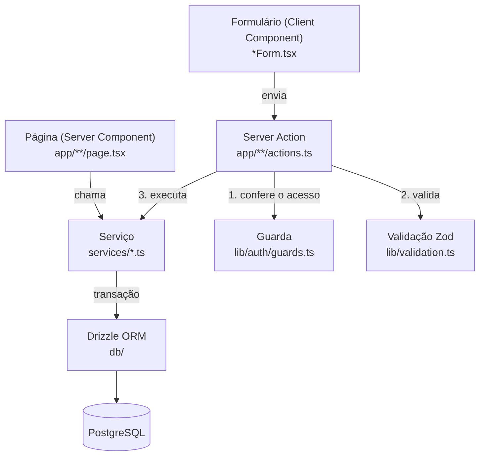
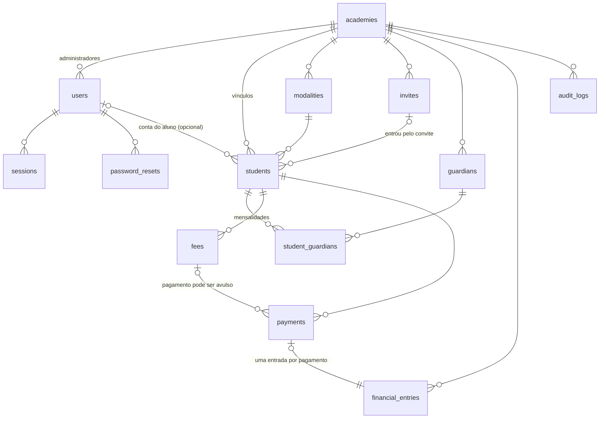
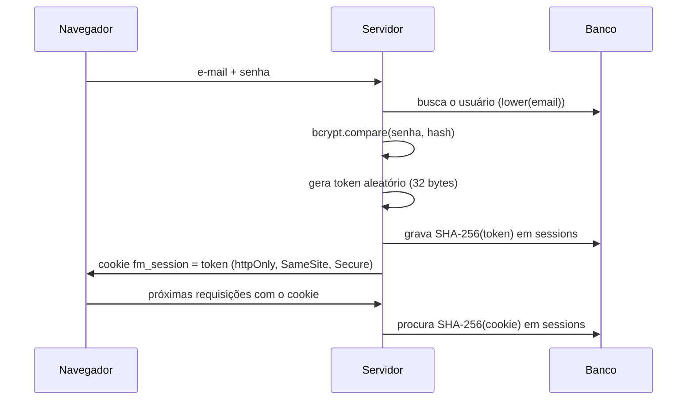
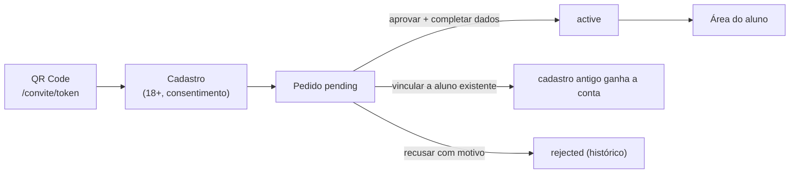
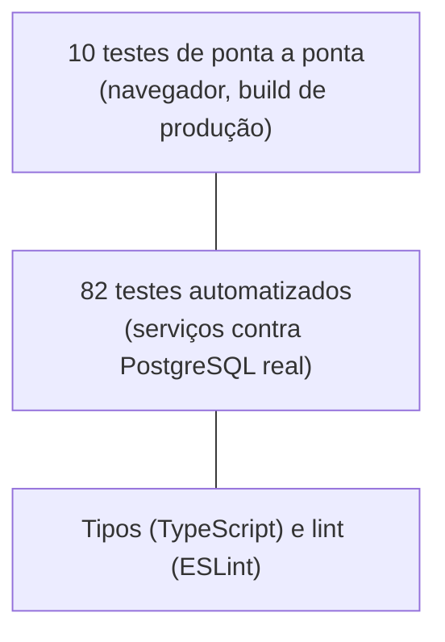

# Fight Manager: guia de estudo e apresentação

Este guia explica o Fight Manager por inteiro: o problema que ele resolve, como o código está organizado, por que cada decisão foi tomada, o que deu errado no caminho e como apresentar o projeto. Ele foi escrito para ser lido com o código aberto ao lado.

**Versão do projeto:** 0.6.0

---

## Sumário

1. [Como usar este guia](#1-como-usar-este-guia)
2. [O projeto em uma página](#2-o-projeto-em-uma-página)
3. [A stack e o porquê de cada peça](#3-a-stack-e-o-porquê-de-cada-peça)
4. [Estrutura de pastas](#4-estrutura-de-pastas)
5. [Arquitetura em camadas](#5-arquitetura-em-camadas)
6. [O caminho de uma ação, passo a passo](#6-o-caminho-de-uma-ação-passo-a-passo)
7. [Banco de dados](#7-banco-de-dados)
8. [Os conceitos que sustentam o sistema](#8-os-conceitos-que-sustentam-o-sistema)
9. [Autenticação e segurança](#9-autenticação-e-segurança)
10. [Os módulos, um por um](#10-os-módulos-um-por-um)
11. [A interface](#11-a-interface)
12. [Testes](#12-testes)
13. [Os problemas encontrados e o que eles ensinam](#13-os-problemas-encontrados-e-o-que-eles-ensinam)
14. [Decisões de projeto e seus custos](#14-decisões-de-projeto-e-seus-custos)
15. [Limitações e próximos passos](#15-limitações-e-próximos-passos)
16. [Roteiro de estudo, com exercícios](#16-roteiro-de-estudo-com-exercícios)
17. [Roteiro de apresentação](#17-roteiro-de-apresentação)
18. [Glossário](#18-glossário)

---

## 1. Como usar este guia

**Para estudar:** leia as seções 2 a 9 na ordem. Elas constroem a base (arquitetura, banco, conceitos). Depois, a seção 10 pode ser lida por módulo, na ordem que você quiser. A seção 16 traz um roteiro com exercícios práticos: mudar o código é o jeito mais rápido de entender de verdade.

**Para apresentar:** comece pela seção 17, que tem o discurso de um minuto, o roteiro da demonstração e as perguntas mais prováveis com respostas. As seções 13 e 14 dão o material que mais impressiona em entrevista: problemas reais e decisões justificadas.

**Convenção:** caminhos como `services/payments.ts` são relativos à raiz do projeto. Os trechos de código são reais, às vezes resumidos (indicado com `// ...`).

---

## 2. O projeto em uma página

### O problema

Academias pequenas de luta costumam controlar alunos e mensalidades em caderno, planilha ou no WhatsApp. Isso causa três problemas recorrentes: não saber quem está atrasado, perder o histórico de pagamentos e gastar tempo cadastrando e cobrando cada aluno à mão.

### O que o Fight Manager faz

É um sistema web de gestão administrativa para academias de luta. O fluxo principal é:

```text
Pesquisar aluno → abrir o perfil → ver a situação financeira → registrar o pagamento
```

Em volta disso, ele oferece:

- **Alunos:** cadastro completo, responsáveis legais para menores, ficha de matrícula para imprimir, contato de emergência, uso de imagem e saúde (restrita).
- **Mensalidades:** geração do mês para todos os ativos com um clique, atraso calculado automaticamente e pagamento parcial.
- **Pagamentos:** registro pela busca de aluno, cancelamento com motivo e recibo com valor por extenso.
- **Financeiro:** entradas automáticas a cada pagamento, despesas e saldo do período.
- **Convite por QR Code:** o aluno se cadastra sozinho, e a academia aprova.
- **Área do aluno:** "estou em dia?" e "quanto e quando pago?".
- **Auditoria:** quem fez o quê e quando.
- **LGPD:** consentimentos, exportação e eliminação de dados.

### A filosofia

> Começar como projeto de portfólio, mas construído com qualidade para poder ser usado de verdade por academias.

Na prática, isso significou três regras durante todo o desenvolvimento:

1. **Nada de tela de mentira.** Tudo o que aparece funciona, contra um banco de dados real.
2. **Nada de funcionalidade só para parecer completo.** Cada campo e cada tela têm uma função real.
3. **Preparar a fundação, não o prédio inteiro.** Por exemplo, o sistema já nasce multi-academia (a base de um SaaS), mas não implementa planos nem cobrança das academias antes da hora.

### Números do projeto

| Item | Quantidade |
| --- | --- |
| Arquivos de código (TypeScript) | 134, cerca de 7.300 linhas |
| Tabelas no banco | 13 |
| Migrations | 7 |
| Serviços (regras de negócio) | 16 |
| Telas e rotas | 28 |
| Testes automatizados (PostgreSQL real) | 82 |
| Testes de ponta a ponta (navegador) | 10 |

---

## 3. A stack e o porquê de cada peça

| Peça | Versão | Para que serve aqui | Por que ela |
| --- | --- | --- | --- |
| **Next.js** | 16 | Framework: telas, rotas e backend no mesmo projeto | Com Server Components e Server Actions, não é preciso escrever uma API REST separada para o próprio sistema usar. |
| **React** | 19 | Componentes da interface | Padrão do Next; o React 19 traz `useActionState` para formulários. |
| **TypeScript** | 6.0 | Tipos em todo o código | Pega erros antes de rodar. Fixado na 6.0 porque o lint ainda não suporta a 7 (ver seção 13). |
| **PostgreSQL** | 16 | Banco de dados | Relacional, com transações, locks e constraints de verdade, essenciais para dinheiro. |
| **Drizzle ORM** | 0.45 | Acesso ao banco com tipos | Fica perto do SQL (dá para ler e prever a consulta) e gera as migrations. |
| **Zod** | 4 | Validação dos dados que chegam | Uma declaração só descreve a regra e gera o tipo TypeScript. |
| **bcryptjs** | 3 | Hash de senha | Algoritmo feito para senhas (lento de propósito); versão em JavaScript puro, sem compilação nativa. |
| **qrcode** | — | Gerar o QR Code do convite | Pequena, madura, gera SVG no servidor. |
| **Vitest** | 5 | Testes automatizados | Rápido e compatível com TypeScript sem configuração. |
| **Playwright** | 1.63 | Testes de ponta a ponta | Controla um navegador de verdade. |
| **ESLint** | 9 | Lint | Com as regras do Next para React, hooks e acessibilidade básica. |
| **Docker** | — | Empacotar para publicar | Mesmo ambiente em qualquer máquina. |

Um ponto que vale saber explicar: **não há biblioteca de componentes visuais** (como Material UI ou shadcn). O CSS é próprio, num arquivo só (`app/globals.css`), com variáveis de cor. Para um sistema administrativo pequeno, isso deixa o projeto mais leve e mostra domínio de CSS.

---

## 4. Estrutura de pastas

```text
fight-manager/
├── app/                          telas e rotas (App Router do Next.js)
│   ├── layout.tsx                HTML base, fonte e CSS global
│   ├── globals.css               todo o visual do sistema
│   ├── login/                    entrar, sair (actions.ts) e formulário
│   ├── esqueci-senha/            pedir o link de recuperação
│   ├── redefinir-senha/[token]/  criar a nova senha pelo link
│   ├── convite/[token]/          página pública aberta pelo QR Code
│   ├── aluno/                    área do aluno (somente leitura), recibos e "meus dados"
│   ├── plataforma/               visão do administrador da plataforma (só números)
│   └── (app)/                    área logada da academia (o "(app)" não aparece na URL)
│       ├── layout.tsx            confere o login e desenha a moldura (menu)
│       ├── page.tsx              Início (dashboard)
│       ├── alunos/               lista, novo, perfil, editar, ficha, exportar
│       ├── mensalidades/         lista, nova, editar, gerar
│       ├── pagamentos/           lista, novo, recibo
│       ├── financeiro/           resumo, movimentações, novo lançamento
│       ├── solicitacoes/         pedidos de entrada pelo convite
│       ├── convidar/             QR Code e link do convite
│       ├── auditoria/            histórico de ações
│       ├── configuracoes/        academia, modalidades, termos, acesso
│       └── documentacao/         manual de uso dentro do sistema
├── components/                   peças de interface reutilizáveis
│   ├── ui.tsx                    cartões, estatísticas, selos, campos (servidor)
│   ├── client.tsx                interativos: busca de aluno, confirmação, dinheiro, avisos
│   ├── Shell.tsx                 moldura: menu lateral e barra inferior do celular
│   ├── Pagination.tsx, skeletons.tsx, Brand.tsx, AddressFields.tsx, ReceiptSheet.tsx
├── services/                     REGRAS DE NEGÓCIO e acesso ao banco
├── lib/                          utilidades puras: dinheiro, datas, validação, CPF, e-mail, auth
├── db/                           schema.ts (tabelas) e index.ts (conexão)
├── drizzle/                      migrations SQL geradas
├── scripts/                      migrate, seed (dados de exemplo), create-admin
├── tests/                        testes automatizados; tests/e2e/ = ponta a ponta
├── docs/                         documentação técnica (inclui requisitos.md)
├── .github/workflows/ci.yml      integração contínua
├── Dockerfile, docker-compose.yml, .env.example
└── package.json, tsconfig.json, eslint.config.mjs, vitest.config.ts, playwright.config.ts
```

**A regra que organiza tudo:** as telas (`app/`) nunca falam com o banco. Elas chamam os serviços (`services/`), que são os únicos que conhecem as tabelas.

---

## 5. Arquitetura em camadas



| Camada | O que faz | O que **não** faz |
| --- | --- | --- |
| **Página** | Busca dados (via serviço) e desenha o HTML no servidor | Não tem regra de negócio nem SQL |
| **Componente cliente** | Interação no navegador: digitar, abrir janela, buscar | Não acessa o banco |
| **Server Action** | Recebe o formulário, confere quem está logado, valida e chama o serviço | Não decide regra de negócio |
| **Serviço** | Regras de negócio, consultas e gravações, sempre filtrando pela academia | Não sabe nada de HTML nem de cookies |
| **Banco** | Guarda os dados e garante as regras críticas (constraints) | — |

**Por que essa separação importa:** os serviços não dependem do Next.js. Por isso os testes chamam os serviços diretamente, contra um PostgreSQL de verdade, sem abrir navegador. E, se um dia o sistema tiver um aplicativo de celular, a mesma regra de negócio serve para uma API.

### Server Component x Client Component

Este é um dos conceitos mais importantes do Next.js moderno, e costuma cair em entrevista:

- **Server Component** (o padrão): roda no servidor, pode acessar o banco (pelo serviço) e manda só HTML para o navegador. Não tem `useState` nem cliques. Exemplo: `app/(app)/alunos/page.tsx`.
- **Client Component** (arquivo começa com `"use client"`): roda no navegador, tem estado e eventos. Exemplo: `components/client.tsx` (busca de aluno, janela de confirmação).

A página do perfil do aluno é um Server Component que monta a tela com dados do banco e, dentro dela, usa pequenos Client Components só onde há interação (o formulário de responsável, o botão de eliminar dados).

---

## 6. O caminho de uma ação, passo a passo

Seguir uma ação do clique até o banco é o melhor jeito de entender o sistema. O exemplo é **registrar um pagamento**.

### Passo 1: o formulário (navegador)

`app/(app)/pagamentos/PaymentForm.tsx` é um Client Component. Ele usa `useActionState`, do React 19, que liga o formulário a uma Server Action e devolve o resultado (erros, valores digitados):

```tsx
const [state, action] = useActionState(createPaymentAction, {});
// ...
<form action={action}>
```

A busca de aluno (`StudentSearch`, em `components/client.tsx`) chama uma Server Action de busca a cada digitação, com espera de 200 ms. Escolhido o aluno, a URL muda para `?aluno=...`, e o servidor devolve as mensalidades em aberto dele.

### Passo 2: a Server Action (servidor)

`app/(app)/pagamentos/actions.ts`:

```ts
export async function createPaymentAction(_: ActionState, form: FormData): Promise<ActionState> {
  const ctx = await requireAcademyAdmin();          // quem é e de qual academia
  let studentId = "";
  const state = await handleForm(form, paymentInput, async (data) => {
    studentId = (await createPayment(ctx, data)).studentId;
  });
  if (!studentId) return state;                      // deu erro: volta para o formulário
  revalidatePath("/", "layout");
  redirect(`/alunos/${studentId}?aba=pagamentos&ok=pagamento-registrado`);
}
```

Três coisas acontecem, sempre nesta ordem:

1. **`requireAcademyAdmin()`** (`lib/auth/guards.ts`) lê o cookie, confere a sessão no banco e devolve o **contexto**: `{ userId, academyId }`. Sem sessão válida, redireciona para o login.
2. **`handleForm`** (`lib/action.ts`) valida os campos com o esquema Zod `paymentInput`. Se algo estiver errado, devolve as mensagens em português para o formulário, sem chamar o serviço.
3. **`createPayment(ctx, data)`** executa a regra de negócio.

### Passo 3: o serviço (regra de negócio)

`services/payments.ts`, resumido:

```ts
export async function createPayment(ctx: AcademyContext, data: PaymentData) {
  return db.transaction(async (tx) => {
    // o aluno precisa ser DESTA academia
    const [student] = await tx.select().from(students)
      .where(and(eq(students.id, data.studentId), eq(students.academyId, ctx.academyId)));
    if (!student) throw new DomainError("Aluno não encontrado.");

    if (data.feeId) {
      const fee = await lockedFee(tx, ctx, data.feeId);   // SELECT ... FOR UPDATE
      const balance = fee.amountCents - (await paidCents(tx, fee.id));
      if (data.amount > balance) throw new DomainError("O valor passa do saldo da mensalidade...");
    }

    const [payment] = await tx.insert(payments).values({ ... }).returning();
    if (payment.status === "paid") await createIncome(tx, ctx, payment, ...); // entrada no financeiro
    if (payment.feeId) await recomputeFee(tx, payment.feeId);                 // paga ou continua em aberto
    await audit(tx, ctx, "payment.created", ...);                             // auditoria
    return payment;
  });
}
```

Tudo dentro de **uma transação**: o pagamento, a entrada no financeiro, a nova situação da mensalidade e o registro de auditoria. Se qualquer passo falhar, nada é gravado.

### Passo 4: a volta para a tela

Com sucesso, a action redireciona para o perfil do aluno com `?ok=pagamento-registrado`. O componente `Flash` (em `components/client.tsx`) lê esse código, mostra "Pagamento registrado com sucesso.", tira o parâmetro da URL (para não repetir ao recarregar) e fecha a mensagem depois de 5 segundos.

**Exercício mental:** refaça esse caminho para "cancelar pagamento" (`cancelPaymentAction` e depois `cancelPayment` em `services/payments.ts`). A estrutura é a mesma.

---

## 7. Banco de dados

### As tabelas



| Tabela | O que guarda |
| --- | --- |
| `academies` | A academia: nome, CPF/CNPJ, contato, endereço, termos da ficha |
| `users` | Contas de acesso: `ACADEMY_ADMIN`, `PLATFORM_ADMIN` ou `STUDENT` |
| `sessions` | Sessões de login (só o **hash** do token) |
| `password_resets` | Pedidos de nova senha (só o hash do token, validade, uso) |
| `modalities` | Modalidades de cada academia, com valor sugerido |
| `invites` | Convites (token do QR Code, validade, limite de usos, revogação) |
| `students` | O **vínculo** de uma pessoa com uma academia (dados da matrícula) |
| `guardians` e `student_guardians` | Responsáveis e a ligação com os alunos (parentesco, principal) |
| `fees` | Mensalidades |
| `payments` | Pagamentos |
| `financial_entries` | Entradas e saídas do financeiro |
| `audit_logs` | Registro das ações importantes |

### Três ideias de modelagem que valem uma pergunta em entrevista

**1. Conta separada do vínculo.** Uma pessoa (a conta, em `users`) é diferente da matrícula dela numa academia (o vínculo, em `students`). O aluno cadastrado pela recepção tem vínculo sem conta; o que se cadastrou pelo convite tem os dois. Isso permite que a mesma pessoa treine em duas academias com uma só conta.

**2. O responsável é um cadastro próprio.** A mãe de dois irmãos é **um** responsável, ligado a dois alunos pela tabela `student_guardians`. Assim, trocar o telefone dela atualiza os dois de uma vez.

**3. "Atrasada" não é guardado.** A mensalidade tem só `pending`, `paid` ou `canceled`. "Atrasada" é calculado: pendente com vencimento antes de hoje. Guardar esse estado exigiria uma tarefa rodando toda madrugada, e ele poderia ficar desatualizado. Calculado, ele é sempre correto.

### Constraints: regras que o banco garante sozinho

| Regra | Onde | O que evita |
| --- | --- | --- |
| Chaves estrangeiras com `RESTRICT` | aluno, mensalidade, pagamento, modalidade, responsável | Apagar um registro que o histórico financeiro usa |
| Uma mensalidade **não cancelada** por aluno e período | `fees_student_reference_unique` (índice parcial) | Gerar o mês duas vezes e duplicar cobranças |
| Um responsável principal por aluno | `student_guardians_one_primary` | Dois contatos de cobrança |
| Aluno aprovado com dados completos | `CHECK students_complete_when_approved` | Aluno ativo sem modalidade ou valor |
| Uma entrada por pagamento | `financial_entries.payment_id` único | Receita contada duas vezes |
| E-mail único sem diferenciar maiúsculas | `users_email_unique` em `lower(email)` | "Ana@x.com" e "ana@x.com" como contas diferentes |

A ideia é ter **duas barreiras**: o código confere a regra e dá uma mensagem amigável, e o banco garante a regra mesmo que o código tenha um erro.

### Migrations

As mudanças no banco ficam em `drizzle/`, em ordem:

| Migration | O que fez |
| --- | --- |
| `0000_init` | Estrutura inicial |
| `0001_invites` | Convites, status do aluno, conta ligada ao vínculo |
| `0002_vinculo_encerrado` | Pedido recusado não bloqueia um novo pedido |
| `0003_cadastro_completo` | Academia, modalidades, responsáveis, CPF, endereço, saúde. **Converte os dados antigos.** |
| `0004_modalidade_ligada` | Remove a coluna antiga de modalidade em texto |
| `0005_consentimento` | Consentimento do convite |
| `0006_senha_e_titular` | Recuperação de senha e eliminação de dados |

A 0003 e a 0004 são um bom exemplo de **migração de dados segura**: primeiro a coluna nova é criada e preenchida a partir dos textos antigos, e só depois a coluna antiga é removida.

---

## 8. Os conceitos que sustentam o sistema

Esta é a seção mais importante para estudar. Cada conceito tem o problema, a solução e onde está no código.

### 8.1 Multi-academia (multi-tenant)

**Problema:** várias academias no mesmo banco. O administrador da Academia A não pode ver nada da Academia B, nem trocando o ID na URL.

**Solução:** todo serviço recebe um `AcademyContext` (`services/context.ts`), que vem **da sessão**, nunca de um campo da requisição, e toda consulta filtra por `academy_id`:

```ts
// services/fees.ts
const [fee] = await tx.select().from(fees)
  .where(and(eq(fees.id, id), eq(fees.academyId, ctx.academyId)))  // o ID sozinho não basta
  .for("update");
```

Não existe no código uma função que busque um aluno "só pelo ID". Se um administrador de A abrir `/alunos/{id-de-um-aluno-de-B}`, o serviço não encontra, e a tela mostra "não encontrado", exatamente como para um ID inexistente. Os IDs são UUID, então nem dá para adivinhar.

**Onde estudar:** `services/context.ts` e o teste "isolamento entre academias" em `tests/business.test.ts`.

### 8.2 Dinheiro em centavos, nunca em ponto flutuante

**Problema:** em quase toda linguagem, `0.1 + 0.2` dá `0.30000000000000004`. Em dinheiro, esse erro vira centavos sumindo.

**Solução:** todo valor é guardado e calculado em **centavos inteiros** (R$ 150,90 = `15090`). A conversão do texto digitado é feita manipulando texto, sem passar por número decimal:

```ts
// lib/money.ts
export function parseMoney(input: string | number | null | undefined): number | null {
  // ...
  if (text.includes(",")) text = text.replace(/\./g, "").replace(",", ".");  // "1.234,56" → "1234.56"
  if (!/^\d+(\.\d{1,2})?$/.test(text)) return null;
  const [whole, fraction = ""] = text.split(".");
  const cents = Number(whole) * 100 + Number(fraction.padEnd(2, "0"));        // 1234*100 + 56
  return Number.isSafeInteger(cents) && cents <= MAX_CENTS ? cents : null;
}
```

As somas (total do mês, saldo) são feitas **no PostgreSQL**, em inteiros. Há um teste só para isso: "não perde centavos em somas (o clássico 0,1 + 0,2)".

### 8.3 Datas no fuso de Brasília

**Problema:** o servidor normalmente roda em UTC. Às 21h de 10/09 em Brasília, em UTC já é 11/09. Sem cuidado, uma mensalidade que vence "hoje" apareceria como atrasada às 21h.

**Solução:** datas de negócio são **datas de calendário** (`2026-09-10`, sem hora), e "hoje" é calculado no fuso configurado:

```ts
// lib/dates.ts
export function today(now: Date = new Date()): string {
  return new Intl.DateTimeFormat("en-CA", { timeZone: TIMEZONE, year: "numeric", month: "2-digit", day: "2-digit" }).format(now);
}
```

O formato `en-CA` produz `AAAA-MM-DD`, que pode ser comparado como texto: `"2026-09-09" < "2026-09-10"`. É isso que permite o cálculo do atraso ser uma linha:

```ts
// lib/fee-status.ts
if (status === "pending" && dueDate < now) return "overdue";
```

Outro cuidado: `dueDateFor("2026-02", 31)` devolve `2026-02-28`. O aluno com vencimento no dia 31 não fica sem mensalidade em fevereiro.

### 8.4 Transações e operações atômicas

**Conceito:** uma transação agrupa várias gravações de forma que ou **todas** acontecem, ou **nenhuma** acontece. Isso é a "atomicidade".

**No projeto:** são 40 transações nos serviços. A regra é simples: toda operação que grava em mais de um lugar usa `db.transaction`. Exemplos: registrar pagamento (4 gravações), cancelar pagamento, gerar o mês, cadastrar aluno com responsável, aprovar convite e eliminar dados.

A **auditoria é gravada dentro da mesma transação da ação**. Por isso nunca existe "ação feita sem registro" nem "registro de ação que falhou".

Há também uma operação atômica feita no próprio SQL: a contagem de usos do convite é `uses_count = uses_count + 1`, em vez de "ler o número, somar 1 no código e gravar", que perderia contagens com dois cadastros ao mesmo tempo.

### 8.5 Locks: quando duas pessoas agem ao mesmo tempo

**Problema clássico (condição de corrida):** a mensalidade é de R$ 150 e duas recepcionistas registram R$ 100 **ao mesmo tempo**. As duas leem "saldo de R$ 150", as duas acham que cabe, e o aluno fica com R$ 200 pagos numa mensalidade de R$ 150.

**Solução:** antes de decidir, a transação **trava a linha** da mensalidade com `SELECT ... FOR UPDATE`. A segunda transação espera a primeira terminar e, quando lê o saldo, já vê R$ 50.

```ts
async function lockedFee(tx: Tx, ctx: AcademyContext, id: string) {
  // FOR UPDATE: dois pagamentos simultâneos na mesma mensalidade não passam do saldo
  const [fee] = await tx.select().from(fees)
    .where(and(eq(fees.id, id), eq(fees.academyId, ctx.academyId))).for("update");
  // ...
}
```

Os locks estão em 8 pontos: mensalidade ao pagar, pagamento ao cancelar e ao confirmar, convite ao ser usado, pedido de entrada ao aprovar, aluno ao vincular a conta, lançamento ao cancelar, pedido de nova senha ao redefinir e aluno ao eliminar os dados.

**E está provado:** `tests/hardening.test.ts` dispara operações **simultâneas** contra o banco real. Dois pagamentos de R$ 100 numa mensalidade de R$ 150, e só um passa; dez pagamentos de R$ 10 numa de R$ 50, e exatamente cinco passam.

### 8.6 Validação no servidor, em três camadas

O navegador nunca é confiável: qualquer pessoa pode enviar uma requisição diretamente, sem passar pela tela. Por isso os formulários têm `noValidate` (a validação do navegador é desligada) e **quem decide é sempre o servidor**, em três camadas:

1. **Formato** (`lib/validation.ts`, Zod): o valor é dinheiro válido? A data existe? O CPF tem dígitos corretos? A pessoa tem 18 anos?
2. **Acesso** (guardas): quem está pedindo pode fazer isso? É desta academia?
3. **Regra de negócio** (serviços): o pagamento passa do saldo? A mensalidade já está paga? O menor tem responsável?

E, por baixo de tudo, o banco (constraints) como última barreira.

### 8.7 Server Actions e formulários no React 19

Uma **Server Action** é uma função que roda no servidor e pode ser usada diretamente como `action` de um formulário. O Next cuida da requisição e da proteção contra CSRF.

O `useActionState` guarda o que a action devolveu. No projeto, o formato é sempre o mesmo (`lib/action.ts`):

```ts
interface ActionState {
  message?: string;                  // mensagem geral ("Confira os campos destacados.")
  errors?: Record<string, string>;   // erro de cada campo
  values?: Record<string, string>;   // o que a pessoa digitou (para não perder)
}
```

**Detalhe importante (e fonte de dois defeitos, ver seção 13):** no React 19, depois que uma action termina, **o formulário é limpo automaticamente**. Por isso a action devolve `values`, e os campos usam `defaultValue={v.campo}` para reaparecer preenchidos. As seleções (`<select>`) exigem um cuidado extra: ganham um `key` com o valor atual.

---

## 9. Autenticação e segurança

### Login e sessão



Pontos para saber explicar:

- **Senha com bcrypt** (custo 12): mesmo com o banco vazado, não dá para descobrir as senhas facilmente.
- **O banco guarda só o hash do token da sessão.** Se o banco vazar, as sessões não servem para entrar.
- **Cookie `httpOnly`:** o JavaScript da página não consegue ler o cookie, o que protege contra roubo por script injetado. `SameSite=Lax` ajuda contra CSRF, e `Secure` faz o cookie só trafegar por HTTPS.
- **Resposta que não revela contas:** quando o e-mail não existe, o sistema ainda compara a senha com um hash qualquer, para o tempo de resposta ser o mesmo. A mensagem é sempre "E-mail ou senha incorretos."
- **Limite de tentativas:** 5 erros por e-mail bloqueiam por 15 minutos.
- **Sessões encerradas:** trocar ou redefinir a senha desconecta os outros aparelhos; desativar um administrador o desconecta na hora.

### Perfis

| Perfil | O que acessa |
| --- | --- |
| `ACADEMY_ADMIN` | Tudo da própria academia |
| `PLATFORM_ADMIN` | Só `/plataforma`: nomes das academias e **contagens**. Nenhum dado de aluno (menor privilégio). |
| `STUDENT` | Só `/aluno`: os próprios dados, somente leitura |

Toda página e toda action chamam uma guarda (`requireAcademyAdmin`, `requireStudent`, `requirePlatformAdmin`) **antes de qualquer outra coisa**. O layout não é a única barreira.

### Recuperação de senha

1. A pessoa informa o e-mail. A resposta é sempre a mesma, exista a conta ou não.
2. Se a conta existe, é gerado um token aleatório. O banco guarda o hash, e o link vai por e-mail.
3. O link vale 30 minutos e **uma vez**. Pedir de novo invalida os anteriores.
4. Ao redefinir, todas as sessões da conta são encerradas.

O envio de e-mail fica atrás de uma interface (`lib/email/index.ts`): Resend (real), desenvolvimento (console) ou memória (testes). Esse é um exemplo do **princípio da inversão de dependência**: o sistema depende de "algo que envia e-mail", não de um fornecedor específico.

---

## 10. Os módulos, um por um

Cada módulo: o que faz, as regras e onde está.

### Alunos (`services/students.ts`, `app/(app)/alunos/`)

- **Busca** por nome, telefone (inclusive só os dígitos), e-mail, CPF **ou pelo nome ou telefone do responsável**. A mãe chega na recepção e diz o nome dela, e a criança aparece.
- **Data de nascimento obrigatória:** sem ela, não dá para saber se o aluno é menor.
- **A leitura comum do aluno (`getStudent`) não traz o campo de saúde.** Ele só é lido por `getHealth`, usada pela aba Saúde. Assim, o dado sensível não chega por engano a nenhuma tela.
- **Ninguém é apagado:** o aluno é marcado como inativo, e o histórico fica. A exceção é a eliminação a pedido do titular (LGPD).

### Responsáveis (`services/guardians.ts`)

- Menor de 18 anos **só é salvo com um responsável principal** (regra em `ensureGuardian`, em `services/students.ts`).
- Irmãos podem compartilhar o responsável; remover o principal de um menor é bloqueado.
- O principal é o **contato de cobrança**: o WhatsApp e o recibo usam os dados dele.

### Modalidades e configuração (`services/academy.ts`, `app/(app)/configuracoes/`)

- Cada academia tem as próprias modalidades. Nada fica fixo no código.
- Modalidade com alunos não é apagada, só desativada (sai das opções de cadastro, mas quem já está nela continua).
- No primeiro acesso, o Início mostra o que falta configurar (`setupStatus`).

### Mensalidades (`services/fees.ts`)

- **Gerar o mês:** cria uma mensalidade para cada aluno ativo que ainda não tem, com o valor e o dia de vencimento do cadastro. Rodar de novo não duplica (índice único parcial).
- **Não é recorrência automática:** a geração só acontece quando o administrador clica.
- **Edição bloqueada** depois de qualquer pagamento. Para corrigir, cancela-se o pagamento.
- **`recomputeFee`:** a situação (paga ou em aberto) é sempre recalculada a partir da soma dos pagamentos confirmados. Ninguém marca "pago" à mão.

### Pagamentos (`services/payments.ts`)

- Vinculado a uma mensalidade ou avulso (matrícula, kimono).
- **Parcial:** R$ 100 numa mensalidade de R$ 150 deixa R$ 50 em aberto.
- **Aguardando confirmação:** o pagamento combinado que ainda não caiu. Ele só entra no caixa quando é confirmado.
- **Cancelar** exige motivo, preserva o registro como cancelado, cancela a entrada do financeiro e devolve a mensalidade para em aberto (ou atrasada).

### Financeiro (`services/finance.ts`)

- **Cada pagamento gera sozinho a entrada correspondente.** O lançamento manual não oferece a categoria "Mensalidade", então nada é contado duas vezes.
- A entrada automática só pode ser desfeita cancelando o pagamento.
- Totais do período calculados no banco.

### Convite e entrada de alunos (`services/invites.ts`, `services/enrollment.ts`)



- O QR Code carrega **só um token aleatório**, e o servidor descobre a academia.
- Qualquer pessoa com o QR pode **pedir** para entrar; só entra quem for aprovado.
- **Sugestão de duplicidade:** se o e-mail ou o telefone batem com um aluno já cadastrado, o sistema sugere vincular. A decisão é sempre do administrador.
- Revogar o convite (gerar um novo código) invalida o QR antigo na hora.

### Área do aluno (`services/student-portal.ts`, `app/aluno/`)

- Responde primeiro às duas perguntas: **"estou em dia?"** e **"quanto e quando pago?"**.
- Toda consulta parte do par (vínculo, conta logada) com status `active`. Trocar o ID na URL não mostra dados de outro aluno.

### Ficha de matrícula e recibo

- **Ficha** (`app/(app)/alunos/[id]/ficha/`): dados da academia, do aluno e do responsável, os termos **escritos pela academia** e as assinaturas. A saúde só entra se o administrador marcar.
- **Recibo** (`services/receipts.ts`, `components/ReceiptSheet.tsx`): valor por extenso (`lib/extenso.ts`), responsável como pagador para menores e marca de cancelado.
- Os dois usam o recurso "imprimir" do navegador (que também salva em PDF), sem biblioteca de PDF.

### Auditoria (`services/audit.ts`)

- Registra usuário, academia, ação e horário, na mesma transação da ação.
- Para a saúde, registra só que houve alteração, **nunca o conteúdo**.

### LGPD (`services/privacy.ts`)

- **Consentimentos registrados** com data e o texto exato aceito.
- **Exportar:** o administrador (ou o próprio aluno) baixa um JSON com tudo.
- **Eliminar:** só para aluno inativo e sem dívida (enquanto há dívida, a academia tem motivo legítimo para manter os dados). Apaga os dados pessoais e troca o nome por "Aluno removido XXXXXX" no financeiro e na auditoria, **mantendo os valores**, porque a contabilidade precisa deles.

### WhatsApp (`lib/whatsapp.ts`)

Não é integração com a API do WhatsApp: é um link `wa.me` com a mensagem pronta. A pessoa revisa e envia pelo próprio aplicativo. Simples e sem custo.

---

## 11. A interface

### Princípios

- **Celular primeiro:** a recepção usa o celular. No celular, há uma **barra inferior** com Início, Alunos, **Registrar pagamento** (em destaque no centro), Mensalidades e Mais. No computador, há um menu lateral.
- **Tabelas viram cartões** no celular, via CSS (`td::before { content: attr(data-label) }`).
- **O que pede ação vem primeiro:** o Início mostra atrasadas e solicitações antes dos números do mês.
- **Um vocabulário só:** A vencer, Atrasada, Paga e Cancelada; "em aberto" é usado só para valores.

### Componentes que valem estudar

| Componente | Arquivo | O que ensina |
| --- | --- | --- |
| `StudentSearch` | `components/client.tsx` | Busca com espera (debounce), teclado (setas e Enter), acessibilidade (`role="combobox"`) |
| `ConfirmSubmit` | `components/client.tsx` | Janela de confirmação com o `<dialog>` nativo do HTML, sem biblioteca |
| `MoneyInput` | `components/client.tsx` | "R$" fixo, teclado numérico, formatação ao sair do campo |
| `Flash` | `components/client.tsx` | Mensagem de sucesso vinda da URL, que se limpa sozinha |
| `Shell` | `components/Shell.tsx` | Navegação responsiva, com barra inferior e menu |
| `Pagination` | `components/Pagination.tsx` | Paginação que preserva os filtros da URL |
| `ListSkeleton` etc. | `components/skeletons.tsx` | Estado de carregamento no formato da tela |

### Estados que toda tela tem

O briefing exigia, e o projeto cumpre: **carregamento** (`loading.tsx`, com esqueletos), **vazio** (`Empty`, com uma ação sugerida), **erro** (`error.tsx`, com "Tentar de novo") e **sucesso** (`Flash`).

---

## 12. Testes

### A estratégia



- **Tipos e lint** pegam erros sem rodar nada.
- **Testes automatizados** (`tests/*.test.ts`, Vitest) chamam os serviços diretamente, contra um **PostgreSQL de verdade** (não um banco falso). Cada teste cria a própria academia, e por isso os testes não interferem uns nos outros.
- **Testes de ponta a ponta** (`tests/e2e/`, Playwright) abrem um navegador de verdade no build de produção e fazem o que uma pessoa faria.

| Arquivo | O que prova |
| --- | --- |
| `money-and-dates.test.ts` | Centavos exatos, fuso de Brasília, atraso, último dia do mês, mensagens de validação |
| `business.test.ts` | Alunos, isolamento entre academias, mensalidades, pagamentos, financeiro, totais |
| `auth.test.ts` | Hash de senha, login, bloqueios |
| `enrollment.test.ts` | Convite, cadastro, aprovação, vínculo, recusa, área do aluno |
| `registration.test.ts` | CPF/CNPJ, modalidades, menores, irmãos, saúde, configuração inicial |
| `hardening.test.ts` | Totais sobre o filtro inteiro, paginação, consentimento, sessões, **concorrência** |
| `titular.test.ts` | Recuperação de senha, valor por extenso, recibo, exportação e eliminação |

### Como um teste de concorrência funciona

```ts
// tests/hardening.test.ts (resumido)
const results = await Promise.allSettled([
  createPayment(ctx, pay(s.id, fee.id, 10000)),   // R$ 100
  createPayment(ctx, pay(s.id, fee.id, 10000)),   // R$ 100, ao mesmo tempo
]);
expect(results.filter((r) => r.status === "fulfilled")).toHaveLength(1);  // só um passa
```

`Promise.allSettled` dispara as duas operações juntas e espera as duas terminarem, com sucesso ou erro. Sem o `FOR UPDATE`, as duas passariam.

### Como rodar

```bash
npm test                              # testes automatizados
npm run lint                          # lint
npm run build && npm run test:e2e     # ponta a ponta
```

O GitHub Actions (`.github/workflows/ci.yml`) roda tudo isso a cada commit, com um PostgreSQL próprio.

---

## 13. Os problemas encontrados e o que eles ensinam

Esta é a seção de maior valor para uma entrevista. Mostrar que você encontrou, entendeu e corrigiu problemas reais vale mais do que dizer que o código não tem problemas.

### 1. Totais errados nas subconsultas

- **Sintoma:** depois de um pagamento parcial, o perfil mostrava R$ 150 em aberto em vez de R$ 50, e a plataforma contava 0 alunos.
- **Causa:** numa consulta de uma tabela só, o Drizzle escreve a coluna sem o nome da tabela (`"id"` em vez de `"fees"."id"`). Dentro da subconsulta, `id` passava a apontar para a tabela **de dentro**, e a comparação nunca batia.
- **Correção:** nas subconsultas, escrever a coluna externa por extenso (`fees.id`).
- **Lição:** um ORM gera SQL, e é preciso saber ler o SQL que ele gera. O teste de regressão ficou no projeto.

### 2. O dia 31 fixo

- **Sintoma:** a tela de gerar mensalidades quebrava em setembro.
- **Causa:** o fim do mês estava escrito como "dia 31", e setembro tem 30 dias.
- **Correção:** a função `monthRange`, que calcula o último dia real de cada mês.
- **Lição:** datas têm casos de borda. Teste fevereiro, meses de 30 dias e anos bissextos.

### 3. Os formulários que se limpavam (React 19)

- **Sintoma A:** errar a senha apagava o e-mail digitado.
- **Sintoma B, mais grave:** no registro de pagamento, escolher "Aguardando confirmação", errar o valor e corrigir fazia a situação voltar para "Pago", **sem aviso**. É um erro com efeito financeiro.
- **Causa:** no React 19, o formulário é limpo depois de cada envio, e o React não reaplica o valor inicial de um `<select>` que já está na tela.
- **Correção:** a action devolve os valores digitados, e cada seleção ganha um `key` com o valor atual, o que força o React a recriá-la.
- **Lição:** atualizar uma biblioteca muda comportamentos sutis, e testes de ponta a ponta pegam o que os de unidade não pegam.

### 4. Totais calculados só sobre a página

- **Sintoma:** com 205 pagamentos, a tela mostrava "R$ 200,00 recebidos" em vez de R$ 205,00.
- **Causa:** a lista mostrava no máximo 200 linhas, e o total somava só as linhas exibidas.
- **Correção:** o total passou a ser calculado no banco, com os mesmos filtros da lista, e as listas ganharam paginação.
- **Lição:** um número financeiro nunca deve depender do que cabe na tela.

### 5. Valor de enum na mesma transação (PostgreSQL)

- **Sintoma:** a migration funcionava num banco existente, mas quebrava numa instalação do zero.
- **Causa:** o PostgreSQL não deixa usar um valor de enum na mesma transação em que ele foi criado, e o Drizzle aplica as migrations pendentes numa transação só.
- **Correção:** uma coluna `closed_at` em vez de comparar o status no índice.
- **Lição:** teste as migrations num banco **vazio**. É o que acontece no primeiro deploy.

### 6. Índice com conversão não imutável

- **Sintoma:** a primeira tentativa de correção do problema anterior também falhou.
- **Causa:** a condição de um índice só aceita operações "imutáveis", e converter um enum para texto não é.
- **Lição:** um `CHECK` aceita coisas que um índice não aceita. Conhecer os limites do banco evita soluções frágeis.

### 7. A eliminação pela metade (LGPD)

- **Sintoma:** depois de eliminar os dados de uma aluna, o nome da **responsável** continuava na auditoria.
- **Causa:** a eliminação trocava o nome da aluna, mas esquecia os nomes das pessoas ligadas a ela. Os testes passavam, porque não conferiam esse caso.
- **Lição:** um teste verde prova só o que ele confere. Revisar o que o teste **não** cobre é parte do trabalho.

### 8. O teste que falhava às vezes

- **Sintoma:** um teste de ponta a ponta passava numas execuções e falhava em outras.
- **Causa:** o seed decidia quem ficava em dia pela ordem de IDs **aleatórios**, então os dados mudavam a cada execução.
- **Correção:** seed determinístico (ordem pelo nome) e teste sem depender de valores fixos.
- **Lição:** teste intermitente não se ignora, investiga-se. Quase sempre há uma causa real.

### 9. O vencimento sugerido no passado

- **Sintoma:** a primeira mensalidade de uma aluna recém-aprovada no dia 24 nascia atrasada.
- **Causa:** o formulário sugeria o dia de vencimento **do mês atual**, que já tinha passado.
- **Correção:** `nextDueDate`, que sugere a próxima ocorrência.
- **Lição:** testar o fluxo completo, como o usuário faz, revela problemas que nenhuma função isolada mostraria.

---

## 14. Decisões de projeto e seus custos

Toda decisão tem um preço. Saber dizer o preço mostra maturidade.

| Decisão | Por quê | O custo |
| --- | --- | --- |
| Server Actions, sem API REST | Menos código; tipos compartilhados; CSRF resolvido pelo Next | Para um aplicativo de celular no futuro, será preciso criar uma API (os serviços já estão prontos para isso) |
| Atraso calculado, não guardado | Nunca fica desatualizado; sem tarefa agendada | Toda consulta de "atrasadas" compara datas (barato, com índice) |
| Sessão no banco, não JWT | Dá para encerrar uma sessão na hora (troca de senha, desativação) | Uma consulta ao banco por requisição |
| Multi-academia desde o início | Evita reescrever tudo quando houver a segunda academia | Todo serviço recebe o contexto; um pouco mais de código |
| Conta separada do vínculo | Mesma pessoa em várias academias; alunos sem conta continuam funcionando | Dois cadastros a entender |
| Cancelar em vez de apagar | Histórico e auditoria preservados | Os registros cancelados continuam no banco |
| CSS próprio, sem biblioteca de UI | Leveza; controle total do visual | Cada componente (janela, busca) foi escrito à mão |
| Impressão do navegador para ficha e recibo | Sem biblioteca de PDF; funciona em qualquer navegador | O layout depende do navegador na hora de imprimir |
| E-mail atrás de uma interface | Troca de fornecedor sem mexer no sistema | Uma camada a mais |
| TypeScript 6.0, e não 7 | Todo o ecossistema (lint, Next, editores) suporta | Fica uma versão atrás do lançamento mais novo |
| Limite de tentativas em memória | Simples, sem dependência | Com vários servidores, cada um conta separado (documentado) |

---

## 15. Limitações e próximos passos

O estado de cada requisito está em `docs/requisitos.md`. As limitações mais relevantes:

- **Docker não testado** no ambiente em que o projeto foi desenvolvido (o arquivo está pronto).
- **Um fuso horário para todo o sistema:** uma academia em Manaus veria atrasos uma hora antes.
- **Cabeçalhos de segurança** (CSP, HSTS) ainda não configurados.
- **Página de "não encontrado"** responde com código 200 em vez de 404, por causa do carregamento em partes do Next. Nenhum dado vaza.

Próximos passos já planejados: convite para responsáveis (entrega B), trancamento de matrícula, reajuste em lote, relatório de inadimplência com CSV e turmas com presença.

---

## 16. Roteiro de estudo, com exercícios

Sugestão de 7 etapas. Faça os exercícios num branch do Git e rode `npm test` depois de cada um.

### Etapa 1: rodar e usar

- Suba o projeto (`README.md`), rode o seed e use o sistema como se fosse a recepção: cadastre um aluno, gere o mês, registre um pagamento parcial e cancele.
- **Exercício:** crie um convite, cadastre-se numa janela anônima e aprove o pedido.

### Etapa 2: a estrutura

- Leia as seções 4 e 5 deste guia com as pastas abertas.
- **Exercício:** abra `app/(app)/alunos/page.tsx` e encontre a chamada ao serviço. Abra o serviço e ache a consulta. Desenhe no papel o caminho da página até o banco.

### Etapa 3: o banco

- Leia `db/schema.ts` inteiro e a seção 7.
- **Exercício:** conecte no banco (`psql`) e rode `\d students`. Encontre no resultado as constraints citadas neste guia.

### Etapa 4: dinheiro e datas

- Leia `lib/money.ts`, `lib/dates.ts` e `tests/money-and-dates.test.ts`.
- **Exercício:** no console do Node, rode `0.1 + 0.2` e depois `parseMoney("0,10") + parseMoney("0,20")`. Explique a diferença.

### Etapa 5: uma regra de ponta a ponta

- Siga a seção 6 com o código aberto.
- **Exercício:** crie a regra "o pagamento não pode ter data no futuro". Faça isso em três lugares: a validação (`lib/validation.ts`), uma mensagem em português e um teste novo em `tests/business.test.ts`.

### Etapa 6: concorrência

- Leia `tests/hardening.test.ts` e a seção 8.5.
- **Exercício:** em `services/fees.ts`, tire temporariamente o `.for("update")` de `lockedFee` e rode `npm test`. Veja o teste de concorrência falhar, entenda por quê e coloque de volta.

### Etapa 7: interface

- Leia `components/client.tsx` e `components/Shell.tsx`.
- **Exercício:** acrescente um atalho "Financeiro" na barra inferior do celular. Depois, pense: vale trocar por "Mensalidades"? O que a recepção usa mais?

---

## 17. Roteiro de apresentação

### O discurso de um minuto

> O Fight Manager é um sistema de gestão para academias de luta, que nasceu de uma situação real: academias pequenas controlam alunos e mensalidades no caderno ou no WhatsApp, e perdem dinheiro com atrasos e erros.
>
> O sistema resolve isso com o fluxo que a recepção mais usa: pesquisar o aluno, ver se está em dia e registrar o pagamento, inclusive parcial. O atraso é calculado automaticamente, cada pagamento vira entrada no financeiro sem contagem dupla, e o aluno pode se cadastrar sozinho por um QR Code na recepção.
>
> Tecnicamente, usei Next.js com TypeScript e PostgreSQL. Tratei o dinheiro em centavos, protegi as operações simultâneas com transações e locks, que estão provados por testes de concorrência, e isolei os dados de cada academia desde a base, pensando em virar um SaaS. São 82 testes contra o banco real, 10 testes no navegador e integração contínua a cada commit.

### Roteiro da demonstração (5 minutos)

1. **Login** e o **Início**: mostre que as atrasadas vêm primeiro. (30 s)
2. **Registrar pagamento:** busque o aluno pelo telefone, registre um valor **parcial** e mostre o saldo em aberto no perfil. (1 min)
3. **Cancele** o pagamento: mostre a janela de confirmação com contexto e a mensalidade voltando para atrasada. (40 s)
4. **Financeiro:** a entrada apareceu e sumiu sozinha. (20 s)
5. **Criança:** cadastre um menor e mostre o responsável exigido. Use a responsável do irmão. Abra a **ficha** para impressão. (1 min)
6. **Convite:** mostre o QR Code, cadastre-se no celular e aprove. (1 min)
7. **No celular:** a barra inferior e o botão de pagamento em destaque. (30 s)

**Dica:** tenha o seed recém-rodado e uma aba anônima já aberta para o convite.

### Perguntas prováveis, com respostas

**"Por que não usou float para dinheiro?"**
Porque o ponto flutuante não representa exatamente valores como 0,1. Em somas, isso gera centavos a mais ou a menos. Guardo tudo em centavos inteiros, e a conversão do que é digitado é feita por texto.

**"Como você garante que uma academia não vê os dados de outra?"**
Todo serviço recebe um contexto que vem da sessão, com o ID da academia, e toda consulta filtra por ele. Não existe busca só pelo ID. E há testes que tentam acessar dados de outra academia e verificam que o sistema recusa.

**"O que acontece se duas pessoas registrarem pagamento ao mesmo tempo?"**
A transação trava a linha da mensalidade com `SELECT FOR UPDATE`. A segunda espera a primeira terminar e vê o saldo atualizado. Escrevi testes que disparam as duas operações ao mesmo tempo para provar isso.

**"Por que o status atrasado não fica salvo?"**
Porque ele depende da data de hoje. Salvo, exigiria uma tarefa diária para atualizar e poderia ficar errado. Calculado, é sempre correto.

**"O que é uma Server Action?"**
Uma função que roda no servidor e pode ser usada direto num formulário. O Next cuida da requisição e da proteção contra CSRF. No projeto, toda action confere o login, valida os dados e chama um serviço.

**"Qual foi o bug mais difícil?"**
Escolha um da seção 13. O de "Aguardando confirmação" virando "Pago" é bom: é sutil, tem impacto financeiro e foi pego pelo teste de ponta a ponta.

**"Como você trata dados sensíveis?"**
Saúde fica numa leitura separada, com consentimento, e a auditoria registra que houve alteração sem guardar o conteúdo. O CPF é mascarado nas listas. O administrador da plataforma não vê dados de alunos. E há exportação e eliminação para atender à LGPD, mantendo o financeiro anônimo.

**"O que você faria diferente ou a seguir?"**
Fuso horário por academia, cabeçalhos de segurança e o convite para responsáveis. E testaria o Docker num servidor real antes de publicar.

**"Você usou IA para fazer o projeto?"**
Seja honesto. Uma boa resposta mostra que você entende e defende cada decisão: explique os conceitos das seções 8 e 13 com as suas palavras. Quem entende o porquê de cada escolha, e sabe onde o sistema ainda é frágil, demonstra exatamente o que a entrevista procura.

---

## 18. Glossário

| Termo | Significado |
| --- | --- |
| **Atomicidade** | Um conjunto de operações acontece por inteiro ou não acontece. |
| **Auditoria** | Registro de quem fez cada ação e quando. |
| **bcrypt** | Algoritmo de hash feito para senhas; lento de propósito. |
| **Client Component** | Componente React que roda no navegador (`"use client"`). |
| **Condição de corrida** | Erro que aparece quando duas operações acontecem ao mesmo tempo. |
| **Constraint** | Regra garantida pelo banco (chave, unicidade, CHECK). |
| **CSRF** | Ataque em que outro site faz o navegador enviar uma ação sem a pessoa querer. |
| **Hash** | Transformação de um dado numa "impressão digital" que não pode ser revertida. |
| **Idempotente** | Operação que pode ser repetida sem mudar o resultado (gerar o mês duas vezes). |
| **Lock (`FOR UPDATE`)** | Trava de uma linha do banco até o fim da transação. |
| **LGPD** | Lei Geral de Proteção de Dados. |
| **Migration** | Arquivo que muda a estrutura do banco de forma versionada. |
| **Multi-tenant** | Várias organizações (academias) no mesmo sistema, com dados isolados. |
| **ORM** | Biblioteca que acessa o banco com a linguagem de programação (aqui, Drizzle). |
| **Seed** | Script que cria dados de exemplo. |
| **Server Action** | Função do servidor chamada direto por um formulário. |
| **Server Component** | Componente React que roda no servidor e envia só HTML. |
| **Sessão** | O "estar logado": um token no cookie, ligado a um registro no banco. |
| **Transação** | Grupo de operações no banco tratado como uma unidade. |
| **UUID** | Identificador aleatório de 128 bits, impossível de adivinhar. |
| **Validação** | Conferência de que um dado está correto antes de usá-lo. |
